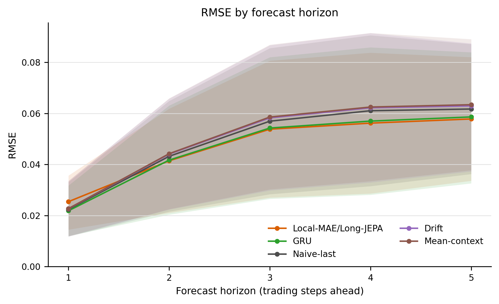

# Stage 04 local-long market-only: context 12

Analysis and local publication: 2026-09-09. This is an exploratory validation sensitivity experiment, not a new held-out test evaluation.

**JEPA-only loss (JEPA:MAE = 2:0) has the lowest mean validation RMSE, 0.048734.** It reduces aggregate RMSE by 5.44% versus naive-last and 0.37% versus GRU. The GRU difference is small, varies across stocks, and is not statistically established. Adding the MAE loss does not improve the aggregate RMSE in this five-point sweep; that observation does not establish that MAE is generally unnecessary.

## Experiment and audit

- Five weights: (0,2), (0.5,1.5), (1,1), (1.5,0.5), (2,0); their sum is always 2. Both configured losses are RMSE. Endpoint labels refer to zero objective weight; they do not imply that every unused module was removed.
- Stocks: NVDA, AAPL, AVGO, TSLA, WMT. Seeds: 42, 44, 46. All 75 stock/seed/candidate runs are complete.
- Downstream context: 12 patches × 5 observations = 60 historical observations. Forecast horizon: 5 trading observations. Features: Close, Volume, MA10, MA50; sentiment is disabled.
- Pretraining remains at 60 observations with patch size 5 and stride 5; configured budget 2,001 epochs. Local MAE window 1 patch, JEPA gap 4 patches, JEPA target 4 patches. Best pretraining-validation checkpoint, EMA encoder weights.
- Downstream budget: 501 epochs, encoder fine-tuning enabled, existing validation checkpoint selection. Saved metadata records trend weight 0.001 and trend selection weight 0.0005; these are unchanged across candidates.
- Chronological validation targets: 2024-07-09 through 2024-12-26, 24 origins × 5 horizons = 120 saved target values per stock/seed. No training or test evaluation was run during this analysis.
- Each candidate passed strict analysis with 75 canonical model rows (15 runs × five methods), zero errors, and zero warnings. Across the five candidates, saved target signatures match by stock/seed/method; GRU and deterministic-baseline metrics are identical across weights.
- Five immutable local snapshots were published with configuration and runtime provenance. All 215 SHA256SUMS entries were verified; no files were omitted by the publication size policy. Source commits are recorded in each snapshot; the new runs record bea9ab584e3ebae7e7982e3f77fd381a9d3d00eb.

## Metrics and aggregation

RMSE is recomputed from saved forecasts in cutoff-relative return space: `Close[t+h] / Close[t] - 1`, with `t` the final historical observation. Historical feature preprocessing uses `window_return`; these metrics are not absolute-price RMSE and are not returns relative to the first context observation.

For each method, average RMSE over seeds within each stock, then average the five stock means. Direction accuracy compares the signs of consecutive horizon movements and includes the known zero-return origin. It is not simply the sign of each cumulative future return. Naive-last predicts a zero path, so its near-zero direction accuracy is a consequence of this definition.

Percent improvements below use ratios of aggregate RMSEs: `100 × (reference RMSE − model RMSE) / reference RMSE`. The per-snapshot paired table instead averages stock-level percentage improvements (5.38% versus naive-last for JEPA-only); those are different estimands.

## Loss-weight comparison

| JEPA:MAE | Validation RMSE | Direction accuracy | RMSE reduction vs naive | SD of three seed means |
| --- | ---: | ---: | ---: | ---: |
| 0:2 | 0.049506 | 52.17% | 3.94% | 0.000485 |
| 0.5:1.5 | 0.049411 | 54.00% | 4.13% | 0.000525 |
| 1:1 | 0.049290 | 50.89% | 4.36% | 0.000249 |
| 1.5:0.5 | 0.049044 | 54.00% | 4.84% | 0.000081 |
| 2:0 | 0.048734 | 53.56% | 5.44% | 0.000329 |

Seed SD is the sample standard deviation of the three seed-specific, five-stock mean RMSEs. It is descriptive variability, not a confidence interval or the cross-stock SD reported in the individual snapshot tables.

| Baseline | Validation RMSE | Direction accuracy |
| --- | ---: | ---: |
| GRU | 0.048914 | 53.72% |
| Naive-last | 0.051538 | 0.33% |
| Drift | 0.052534 | 54.17% |
| Mean-context | 0.052817 | 54.67% |

All five TS-JEPA weight settings beat naive-last on all five stock means and all 15 stock/seed runs. Only the JEPA-only setting beats GRU on aggregate RMSE. The highest aggregate direction accuracy among the TS-JEPA settings is 54.00%, shared by 0.5:1.5 and 1.5:0.5; JEPA-only reaches 53.56%, compared with GRU at 53.72%.

## Seed and stock stability

| JEPA:MAE | Seed 42 RMSE | Seed 44 RMSE | Seed 46 RMSE |
| --- | ---: | ---: | ---: |
| 0:2 | 0.048995 | 0.049563 | 0.049959 |
| 0.5:1.5 | 0.048818 | 0.049592 | 0.049821 |
| 1:1 | 0.049576 | 0.049176 | 0.049119 |
| 1.5:0.5 | 0.048980 | 0.049135 | 0.049019 |
| 2:0 | 0.048853 | 0.048362 | 0.048987 |

JEPA-only wins the weight sweep for seeds 44 and 46; 0.5:1.5 wins for seed 42. By stock mean, JEPA-only wins the weight sweep on AVGO and TSLA; 1.5:0.5 wins on AAPL, MAE-only on NVDA, and 0.5:1.5 on WMT.

| Stock | JEPA-only RMSE | GRU RMSE | JEPA-only − GRU |
| --- | ---: | ---: | ---: |
| AAPL | 0.021321 | 0.021331 | -0.000010 |
| AVGO | 0.067301 | 0.068887 | -0.001586 |
| NVDA | 0.054706 | 0.053827 | +0.000879 |
| TSLA | 0.083233 | 0.085042 | -0.001810 |
| WMT | 0.017109 | 0.015484 | +0.001626 |

JEPA-only beats GRU on three of five stock means and eight of 15 stock/seed runs. Its stock-mean paired RMSE difference is -0.000180; the 95% stock-bootstrap interval is [-0.001360, +0.001000], with exact two-sided signed-rank p = 0.8125. This is an exploratory comparison of the observed grid winner, without correction for choosing that winner.

Against naive-last, JEPA-only has mean paired difference −0.002804 and a stock-bootstrap 95% interval [−0.004206, −0.001402]. Its exact p-value is 0.0625 and the repository’s within-candidate Holm-adjusted p-value is 0.125. With only five independent stock units, these tests provide limited resolution; the bootstrap interval and exact test need not agree. The Holm adjustment does not correct selection across the five loss weights.

At horizon 1, JEPA-only RMSE is 0.025419 versus GRU 0.021856 and naive-last 0.022409. Its aggregate advantage comes from horizons 2–5, where its RMSE is lower than both. This does not support a uniform improvement at every forecasting horizon.



The plotted Local-MAE/Long-JEPA row uses weights 2:0. Shading represents stock-bootstrap 95% intervals for each method, not paired-difference confidence intervals.

## Comparison with the previous 24-patch market-only sweep

| JEPA:MAE | 24-patch RMSE | 12-patch RMSE | Reduction with 12 patches |
| --- | ---: | ---: | ---: |
| 0:2 | 0.049458 | 0.049506 | -0.10% |
| 0.5:1.5 | 0.050278 | 0.049411 | +1.73% |
| 1:1 | 0.049780 | 0.049290 | +0.98% |
| 1.5:0.5 | 0.049223 | 0.049044 | +0.36% |
| 2:0 | 0.049897 | 0.048734 | +2.33% |

Twelve patches reduce aggregate RMSE for four of five weight settings; MAE-only is slightly worse. The best weight changes from 1.5:0.5 at 24 patches to 2:0 at 12. GRU moves in the opposite direction: its 24-patch RMSE is 0.048072, lower than its 12-patch 0.048914 and lower than the best new TS-JEPA row. Thus the new sweep does not establish overall superiority to the longer-context GRU.

Target alignment was checked directly for all 75 matched old/new stock/seed/candidate pairs: all 120 target dates, rolling steps, horizons, and true values match exactly. Stored target signatures differ because `target_index` has a constant offset of 60 when the historical context changes. The same pretrained checkpoint paths are recorded across context sizes. The old runs record commit 0a1119491cbbbc24c2f454082c9d4b3c18931b5d; comparison with the new run commit shows no changes to the financial training/evaluation Python code. The comparison is still descriptive and uses the already-observed validation period.

## Interpretation limits

This supports a narrow observation: in this local-long, market-only, 60-observation downstream setting, the JEPA-only loss has the best aggregate validation RMSE among the five tested weights. Its advantage over GRU is too small and inconsistent to claim a reliable improvement. No random-initialized Transformer control is added here, so the comparison does not isolate the causal benefit of pretraining. The endpoint losses retain the local-long masking and training procedure.

The [earlier Chapter 5 audit](chapter5_stage00_to_stage04_analysis.md#63-stage-04-validity-boundary) documents that Stage 04 exploration followed observation of the original held-out test results. These additional validation runs do not restore an untouched holdout. Treat the findings as exploratory sensitivity evidence; they do not retroactively select a confirmatory final model.

## Published snapshots and reproduction

Publication here means local immutable artifacts under `thesis_results/`. No Git commit, remote push, release upload, or new model training was performed.

| JEPA:MAE | Context-12 snapshot | Earlier context-24 snapshot |
| --- | --- | --- |
| 0:2 | [report and artifacts](../thesis_results/04_local_long_joint_loss_jepa_0_mae_2_market_only_context_12/af1154ee3aa5-33462a976ed7/README.md) | [report and artifacts](../thesis_results/04_local_long_joint_loss_jepa_0_mae_2_market_only/04379d188c8f-d6dbc63b47bd/README.md) |
| 0.5:1.5 | [report and artifacts](../thesis_results/04_local_long_joint_loss_jepa_0_5_mae_1_5_market_only_context_12/23caa94f7e55-4ca51d2f2ad7/README.md) | [report and artifacts](../thesis_results/04_local_long_joint_loss_jepa_0_5_mae_1_5_market_only/2b5e1bd7c70c-717d8cf61a1b/README.md) |
| 1:1 | [report and artifacts](../thesis_results/04_local_long_joint_loss_jepa_1_mae_1_market_only_context_12/0772fa5014a4-277b0ec99504/README.md) | [report and artifacts](../thesis_results/04_local_long_joint_loss_jepa_1_mae_1_market_only/b6fed2a8eb26-22ea9e914198/README.md) |
| 1.5:0.5 | [report and artifacts](../thesis_results/04_local_long_joint_loss_jepa_1_5_mae_0_5_market_only_context_12/83a5fb9644b3-e187ce99031f/README.md) | [report and artifacts](../thesis_results/04_local_long_joint_loss_jepa_1_5_mae_0_5_market_only/5f04d593fb55-114d2c962682/README.md) |
| 2:0 | [report and artifacts](../thesis_results/04_local_long_joint_loss_jepa_2_mae_0_market_only_context_12/8557306152e4-d9348a7d2b9d/README.md) | [report and artifacts](../thesis_results/04_local_long_joint_loss_jepa_2_mae_0_market_only/86afd569429e-edb1dced005c/README.md) |

Each snapshot includes canonical CSV data, LaTeX tables, PDF/PNG figures, the strict audit, provenance, a publication manifest, and checksums. Representative raw trajectories and pretraining-loss history figures were unavailable and are explicitly marked omitted in the artifact manifest; this is separate from publication-policy omissions.

Regenerate the five standard analyses and publish their snapshots from the repository root:

```bash
conda activate ts-jepa
set -euo pipefail
for config in config/experiments/chapter5_candidates/stage04_market_only_context_12/*.json; do
  python analyze_thesis_results.py --config "$config" \
    --reference-strategy local_long --bootstrap-samples 20000 --analysis-seed 20260822
  name="${config##*/}"
  name="${name%.json}"
  python publish_thesis_results.py --analysis-dir "analysis_artifacts/$name"
done
```

The additional JEPA-only-versus-GRU comparison uses the published `data/all_runs_tidy.csv`: pair by stock/seed, average seed-level RMSE differences within stock, then call `bootstrap_mean_ci` with 20,000 samples and NumPy generator seed 20260822 and `exact_wilcoxon` from `analysis/thesis_results.py` on the five stock differences.
