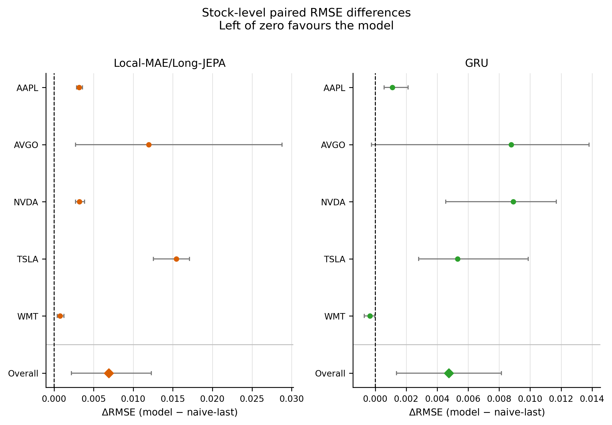

# Stage 05 benchmark: local-long, market-only, context 12

**The selected TS-JEPA procedure underperforms naive-last in RMSE on every stock and every seed.** Mean RMSE is 0.053304, 14.87% above naive-last and 4.20% above GRU. Direction accuracy is highest among the five reported methods at 51.41%, but the advantage over GRU is small and uncertain.

[Published snapshot, tables, figures, and provenance](../thesis_results/05_benchmark_local_long_market_only_context_12/4bcd5b1d1831-046f8d819c7a/README.md). Publication is local under `thesis_results/`; no Git commit or remote push was performed.

## Experiment and coverage

- Model: Local-MAE/Long-JEPA, JEPA:MAE weights **1.5:0.5**, both pretraining losses configured as RMSE. This was selected from Stage 04 validation results using the existing `0.30 × RMSE rank + 0.70 × direction-accuracy rank` rule, with average ranks for ties. The selection score is 1.65. It is distinct from the Stage 04 minimum-RMSE endpoint (2:0).
- Market-only features: Close, Volume, MA10, MA50. Historical context: 12 patches × 5 observations = 60 observations. Forecast horizon: 5 observations. No sentiment input.
- Stocks: NVDA, AAPL, AVGO, TSLA, WMT. Seeds: 42, 44, 46. All **15 stock/seed runs** are complete, with 75 canonical method rows including GRU, naive-last, drift, and mean-context.
- Evaluation targets: **2025-01-02 through 2025-12-31**, 50 rolling origins × 5 horizons = 250 saved target values per stock/seed; stride 5. The configured development period ends in 2024, with chronological internal validation.
- Pretraining: 60-observation windows, patch size 5, stride 5, 2,001 configured epochs. Local MAE window 1 patch, JEPA gap 4 patches, JEPA target 4 patches. Best pretraining-validation checkpoint, EMA encoder weights.
- Downstream: 501 configured epochs, encoder fine-tuning enabled, existing validation-based checkpoint selection. Saved source commit: `c8259a8ebe4a39b88e99ea33cb42d3bd41adb08c`.
- Runtime effective configuration matches the requested benchmark config. Strict saved-artifact analysis reports **zero errors and zero warnings**. All 43 published-file checksums were verified; no files were omitted by publication policy.

## Metrics and main result

RMSE is recomputed from saved rolling forecasts in cutoff-relative return coordinates: `Close[t+h] / Close[t] - 1`, where `t` is the last historical observation. Historical feature normalization is `window_return`. Values are not absolute-price errors. Metrics are averaged across seeds within each stock, then across the five stock means.

Direction accuracy compares signs of consecutive forecast-horizon movements, including the known zero-return origin. It is not simply the sign of cumulative return at each horizon. Naive-last predicts a constant zero-return trajectory; its 0.16% direction accuracy follows from this definition and should not be interpreted as the performance of a conventional binary classifier.

| Method | Mean RMSE | Direction accuracy |
| --- | ---: | ---: |
| Local-MAE/Long-JEPA | 0.053304 | 51.41% |
| GRU | 0.051156 | 50.75% |
| Naive-last | 0.046404 | 0.16% |
| Drift | 0.049100 | 50.40% |
| Mean-context | 0.048911 | 50.40% |

TS-JEPA has the highest aggregate RMSE among the five methods. Naive-last has the lowest aggregate RMSE and wins on four stock means; GRU wins on WMT. TS-JEPA loses to naive-last on **5/5 stock means and 15/15 stock/seed runs**. It beats GRU only on NVDA at the stock level and on 4/15 individual runs.

Percentage differences above are ratios of aggregate RMSEs. The published paired table averages stock-level percentage differences instead and reports a 12.97% mean relative deterioration versus naive-last; the two summaries use different estimands.

## Stock and seed behavior

| Stock | TS-JEPA RMSE | GRU RMSE | Naive-last RMSE | TS-JEPA minus naive |
| --- | ---: | ---: | ---: | ---: |
| AAPL | 0.037580 | 0.035506 | 0.034413 | +0.003167 |
| AVGO | 0.067217 | 0.064034 | 0.055249 | +0.011968 |
| NVDA | 0.055742 | 0.061473 | 0.052557 | +0.003184 |
| TSLA | 0.076333 | 0.066218 | 0.060898 | +0.015435 |
| WMT | 0.029646 | 0.028551 | 0.028901 | +0.000746 |

The largest absolute RMSE penalties are on TSLA and AVGO. The deterioration is not confined to those stocks: all five stock means are worse than naive-last.

| Seed | TS-JEPA mean RMSE | GRU mean RMSE | Naive-last mean RMSE |
| --- | ---: | ---: | ---: |
| 42 | 0.050865 | 0.052411 | 0.046404 |
| 44 | 0.052211 | 0.049223 | 0.046404 |
| 46 | 0.056835 | 0.051836 | 0.046404 |

The sample SD across the three seed-specific five-stock mean RMSEs is 0.003131 for TS-JEPA and 0.001699 for GRU. This describes seed variability, not a confidence interval. TS-JEPA beats GRU for seed 42 but loses for seeds 44 and 46; no seed reverses its aggregate loss to naive-last.

## Paired uncertainty and horizon behavior

TS-JEPA minus naive-last has mean stock-level paired RMSE difference **+0.006900**, with a stock-bootstrap 95% interval **[+0.002202, +0.012288]**. The exact two-sided signed-rank p-value is 0.0625 and the within-analysis Holm-adjusted p-value is 0.125. There are only five independent stock units; bootstrap intervals and coarse exact tests need not agree. The observed underperformance is consistent across runs, while conventional significance claims remain limited.

TS-JEPA minus GRU has mean paired RMSE difference **+0.002147**, bootstrap 95% interval **[-0.002562, +0.006898]**, and unadjusted exact p = 0.4375. Its direction-accuracy advantage over GRU is **+0.67 percentage points**, with a stock-bootstrap interval **[−1.97, +2.75] percentage points** and unadjusted exact p = 0.625. These additional GRU comparisons do not establish a reliable advantage.

Naive-last has lower aggregate RMSE than TS-JEPA at every forecast horizon, 1 through 5. GRU also has lower RMSE than TS-JEPA at every horizon. TS-JEPA direction accuracy varies from 48.27% at horizon 3 to 55.33% at horizon 2; no claim of profitable trading follows from these metrics.



Positive differences favour naive-last. Stock-row intervals resample the three seed differences and are descriptive. The overall interval resamples the five stock means, preserving stocks as the independent units.

## Relation to validation and interpretation

The same 1.5:0.5 candidate had validation RMSE 0.049044, versus naive-last 0.051538, and direction accuracy 54.00%. Its validation advantage over naive-last therefore does not persist into these 2025 observations. The two periods have different observations and 24 versus 50 forecast origins; their metrics are descriptive period summaries, not paired observations for a significance test.

The weighted validation selection favoured direction accuracy, so RMSE alone was not its selection objective. Nevertheless, the 2025 direction advantage over GRU is uncertain and the error penalty versus deterministic baselines is material. This benchmark does not support improved forecasting RMSE from the selected local-long procedure. It also does not isolate the causal contribution of pretraining without a matched randomly initialized Transformer control.

The configuration explicitly records `retrospective_test_period`. The [earlier Chapter 5 audit](chapter5_stage00_to_stage04_analysis.md#63-stage-04-validity-boundary) documents prior observation of test outcomes before further Stage 04 exploration. These are retrospective test-period results, not a fresh untouched confirmatory holdout. No weights, model selection, or training were changed during this analysis.

## Reproduction and publication contents

```bash
conda activate ts-jepa
python analyze_thesis_results.py \
  --config config/experiments/chapter5_benchmark/05_benchmark_local_long_market_only_context_12.json \
  --reference-strategy local_long --bootstrap-samples 20000 --analysis-seed 20260822
python publish_thesis_results.py \
  --analysis-dir analysis_artifacts/05_benchmark_local_long_market_only_context_12
```

The snapshot contains canonical CSV data, paired comparisons, stock and horizon summaries, LaTeX tables, PDF/PNG figures, audit metadata, the experiment config and runtime manifest, publication manifest, and `SHA256SUMS`. No raw checkpoints or datasets are added. Shared-vs-local comparisons, representative raw trajectories, and pretraining history figures were unavailable and are explicitly recorded as omitted in the artifact manifest.

The extra TS-JEPA-versus-GRU comparisons use published `data/all_runs_tidy.csv`: pair by stock/seed, average seed differences within each stock, and apply `bootstrap_mean_ci` (20,000 samples, NumPy generator seed 20260822) and `exact_wilcoxon` from `analysis/thesis_results.py` to the five stock differences. RMSE and direction comparisons each initialize that generator independently. Their p-values are descriptive and unadjusted.
