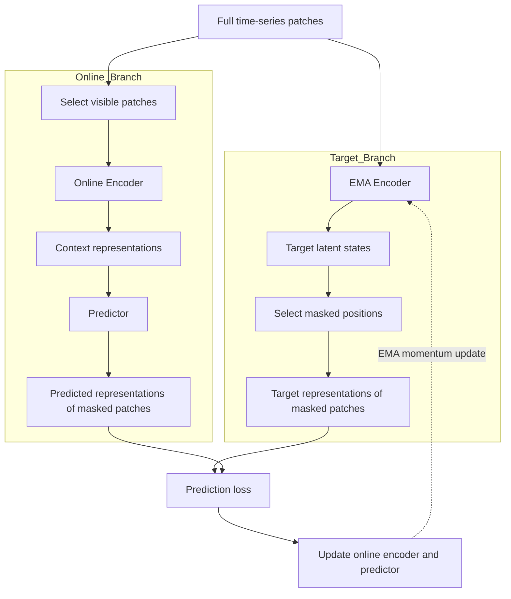
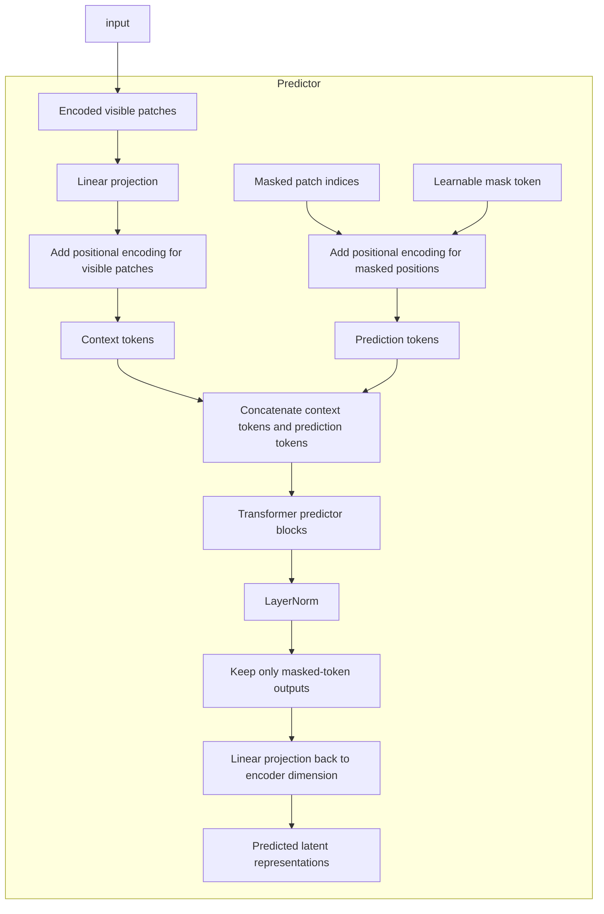

```mermaid
flowchart TD
    A["Full time-series patches"]

    subgraph Target_Branch
        T1["EMA Encoder"]
        T2["Target latent states"]
        T3["Select masked positions"]
        T4["Target representations of masked patches"]
    end

    subgraph Online_Branch
        O1["Select visible patches"]
        O2["Online Encoder"]
        O3["Context representations"]
        O4["Predictor"]
        O5["Predicted representations of masked patches"]
    end

    A --> T1
    T1 --> T2
    T2 --> T3
    T3 --> T4

    A --> O1
    O1 --> O2
    O2 --> O3
    O3 --> O4
    O4 --> O5

    T4 --> L["Prediction loss"]
    O5 --> L

    L --> U["Update online encoder and predictor"]
    U -. "EMA momentum update" .-> T1
```

```mermaid
flowchart TD
    O["input"]
    subgraph Predictor
        A["Encoded visible patches"]
        B["Linear projection"]
        C["Add positional encoding for visible patches"]
        D["Context tokens"]

        E["Masked patch indices"]
        F["Learnable mask token"]
        G["Add positional encoding for masked positions"]
        H["Prediction tokens"]

        I["Concatenate context tokens and prediction tokens"]
        J["Transformer predictor blocks"]
        K["LayerNorm"]
        L["Keep only masked-token outputs"]
        M["Linear projection back to encoder dimension"]
        N["Predicted latent representations"]

    end
    O --> A
    A --> B
    B --> C
    C --> D

    E --> G
    F --> G
    G --> H

    D --> I
    H --> I
    I --> J
    J --> K
    K --> L
    L --> M
    M --> N
```

xxx