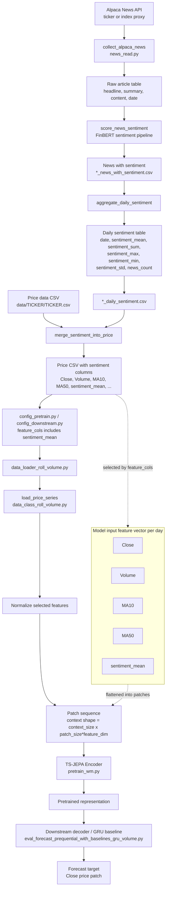

# Sentiment Feature Flow

Sentiment is included as an input feature, not as the target. The downstream target remains `Close`, while `sentiment_mean` is one of the context features used by the encoder and decoder.
